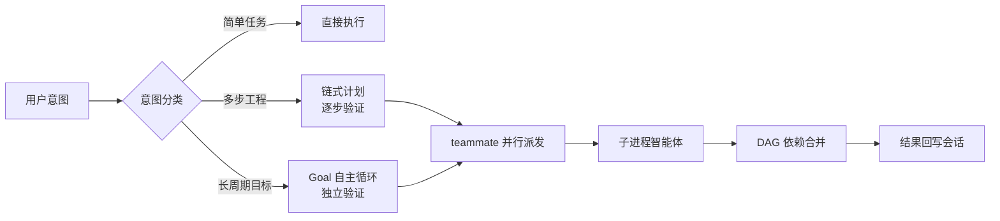

理解 Maestro Flow 的分层架构与核心概念，是深入使用与配置的基础。

---

## 三插件分层

**pi-maestro-flow** 由三个插件组成（装一个即得全部）：

| 插件 | 职责 | 一句话 |
|------|------|--------|
| **pi-maestro-flow** | 编排层与安装入口 | 目标/任务/计划、知识系统、MCP/LSP/浏览器/搜索 |
| **pi-maestro-teammate** | 执行引擎 | 并行子进程智能体、DAG 依赖图、模型路由 |
| **pi-cockpit** | 可视化状态 | 编辑器上方实时状态堆栈 + Starship 风格 Footer |

> 简言之：**flow 负责「编排与知识」，teammate 负责「并行执行」，cockpit 负责「看见」**。

## 核心概念

### 工具面（Tool Surface）

- **19 个常驻工具 + 5 个 Plan 动态工具**
  - 调度：`teammate` · `teammate-send/list/watch/wait`
  - 编排：`maestro` · `goal` · `todo` · `run-control` · `plan-*`
  - 连接：`mcp` · `lsp` · `browser` · `smart_search` · `ffgrep`/`fffind`
  - 其他：`bash_bg` · `ask-user-question` · `search_tool_bm25`

Plan 模式下额外激活 `plan-enter` / `plan-update` / `plan-review` / `plan-confirm` / `plan-exit` / `plan-status` 等只读规划工具。

### 执行模型



- **意图路由**：Maestro Flow 自动分类意图并路由到正确的执行通道。
- **并行派发**：一次派出多个子进程智能体并行工作，支持 DAG 依赖图。
- **生命周期**：Goal（长时目标）→ Plan（计划批准）→ todo（任务跟踪）→ Run（工作流运行控制）。

### 知识系统（Knowledge Gate）

任何代码访问或调度之前执行知识门：

```bash
maestro search "<查询>" [--type spec|knowhow|domain|issue] [--code]
maestro load --type <type> [--id <id>]
```

知识类型：`spec`（规范，按 arch/coding/debug/test/review/learning/ui 分类）、`knowhow`（经验配方）、`domain`（术语表）、`issue`（问题跟踪）、`roadmap`（里程碑）。详见[知识系统](/guides/knowledge)。

### 运行时子系统

| 子系统 | 作用 |
|--------|------|
| **Compaction 容量管理** | 上下文达到阈值自动修剪，防止长会话溢出 |
| **模型熔断与故障转移** | 电路断路器保护 API 调用，自动切备用模型 |
| **GUI 子系统（UCL）** | `PI_GUI=1` 启用，UCL（Unified Communication Layer，统一通信层）HTTP 工具发现/调用 + SSE 事件 |
| **TUI 界面组件** | Goal 面板、Todo 覆盖层、进度树、状态栏等 |
| **self-evolve 自进化层** | 运行轨迹 → 知识沉淀闭环的候选信号层（M1-M5：瘦路由器、健康侧车、提案治理、canary 验证），默认禁用（见 [新特性使用说明](https://github.com/catlog22/pi-maestro-flow/blob/main/docs/new-features-usage.md)） |
| **权限系统** | 5 种模式 + 细粒度 allow/ask/deny + 子进程 IPC 中继 |

## 数据与配置文件位置

| 路径 | 内容 |
|------|------|
| `~/.pi/agent/settings.json` | 用户级设置（compaction、failover 等，`PI_CODING_AGENT_DIR` 可覆盖） |
| `<项目>/.pi/settings.json` | 项目级设置（覆盖用户级） |
| `~/.pi/agent/cockpit.json` | Cockpit 界面配置 |
| `~/.pi/agent/vision-delegation.json` | Vision 委托配置 |
| `~/.pi/agent/model-failover.json` | 模型故障转移配置 |
| `~/.pi/web-search.json` | Smart Search 原生路径配置 |
| `%LOCALAPPDATA%/smart-search/config.json` | Smart Search Python CLI 路径配置 |

各配置项的详细说明见[配置参考](/guides/settings-overview)分类。

## 下一步

- [并行多智能体调度](/guides/teammate-dispatch) — 核心执行能力
- [Goal 目标 · Plan 计划 · todo 任务](/guides/goal-plan-todo) — 编排生命周期
- [知识系统](/guides/knowledge) — 跨会话持久化知识
