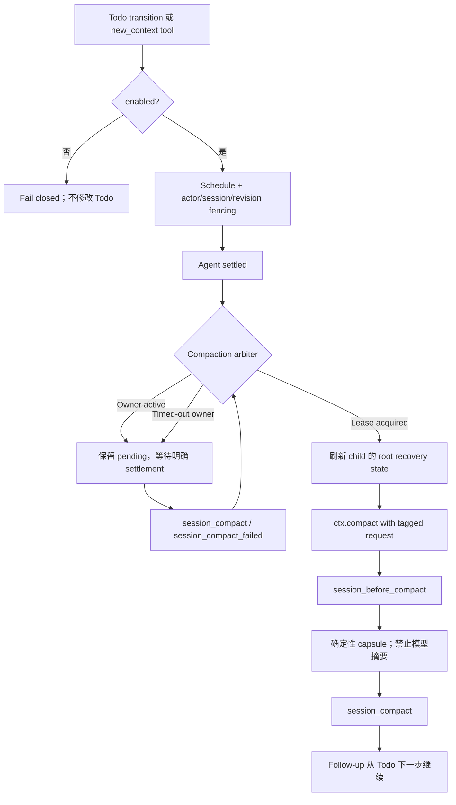

`new_context` 在**同一个 Pi Session 内**创建一个干净的模型上下文，并通过确定性的 recovery capsule 恢复任务状态。它适合阶段切换，不是 automatic compact 的替代品。

---

## 一句话理解

- **Automatic/native compact** 解决“上下文快满了”：修剪工具结果、生成摘要、处理 overflow 与输出截断。
- **New Context** 解决“当前阶段已经结束，旧探索过程不值得带入下一阶段”：不调用模型摘要，只保留权威状态与明确交接信息。

| 能力 | Automatic/native compact | New Context |
|------|--------------------------|-------------|
| 主要触发 | Token 压力、overflow、手动 `/compact` | Agent 显式调用或 Todo transition |
| 摘要方式 | 可调用模型生成摘要 | 不调用模型，生成确定性 capsule |
| 保留内容 | 摘要 + 近期对话 | Todo/Goal/Plan/Workflow/checkpoint/resources 等权威状态 |
| 适用时机 | 上下文容量不足 | Todo/语义阶段的自然边界 |
| 默认状态 | 开启 | 开启，可显式关闭 |

## 配置

用户级配置位于 `~/.pi/agent/settings.json`，项目级配置位于 `<项目>/.pi/settings.json`；项目字段覆盖用户字段。

配置可省略，New Context 默认开启。若需要显式覆盖，可在用户级或项目级设置布尔值：

```json
{
  "compaction": {
    "newContext": {
      "enabled": false
    }
  }
}
```

也可以在 Cockpit 的 `/maestro-settings` 中进入 Flow provider，搜索 `New Context`，用 `Space` 切换当前 scope，再用 `Ctrl+S` 保存。列表在未设置覆盖时会同时显示实际生效值。

工具面随 effective 配置动态变化：

- `true`（默认）：在 Session 启动或下一次 Agent turn 前注册并激活 `new_context`，同时允许 `session_history` 的 `timeline` / `read_checkpoint` 恢复动作；
- 显式 `false`：下一次 Agent turn 前从 active tool surface 移除 `new_context`；`session_history` 仍可用于普通历史读取，但 checkpoint 恢复动作会 fail closed。

> 该开关只启用显式 reset 及其当前会话恢复工具，不改变 automatic/native compact 的 reserve、soft band、hard threshold 或 fallback 行为。

## 两种调用方式

### 1. 在 `advance` 中主动切换

如果 Agent 在调用前已经从任务计划确认当前 completion 是可恢复的语义边界，可以在 completion-form `advance` 中主动请求切换：

```javascript
todo({
  action: "advance",
  id: "3",
  summary: "认证模块已完成并通过聚焦测试",
  resourceUris: ["agent://<publication-id>"],
  transition: "new_context"
})
```

Todo mutation 先提交，reset 再调度。即使调度失败，已完成的 Todo 也不会回滚；Agent 会在 tool result 中看到失败原因，并继续使用当前 context。

`transition` 必须在调用 `advance` 时决定。Context-pressure advisory 是该次 `advance` 已提交后才附加到结果中的提醒，不能反向修改已经完成的调用。

### 2. Standalone 工具与 post-advance 提醒

无需完成 Todo、但已经形成明确交接点时，可以直接调度 standalone 工具：

```javascript
new_context({
  carryForward: "下一步先核对迁移后的索引，再运行 users-index.test.ts",
  resourceUris: ["agent://<publication-id>", "session://<session-id>/entry/<entry-id>"]
})
```

另一种情况是：Agent 先执行未携带 `transition=new_context` 的 completion-form `advance`，结果在提交当前 Todo 并可能激活下一 Todo 后包含 `[context-pressure-advisory]`。Agent 必须先检查同一结果中的当前任务状态；只有仍存在后续阶段且满足下述恢复条件时，才随后调用 standalone `new_context`。提醒不能带到无关的后续 Todo 再使用。

- `carryForward` 最多 4 KiB UTF-8，用于补充一条简短、不可从权威状态推导的指令或事实；
- `resourceUris` 最多 16 项，应优先使用稳定、精确的资源引用；
- 请求在当前 Agent turn 完全 settled 后执行，不会打断正在运行的工具调用。

## 何时应该使用

只有同时满足以下条件时才适合 reset：

1. 当前 Todo 或语义阶段已经完成；
2. `Todo.context` 已写入精确下一步，完成结果已进入 `summary`；
3. 关键证据已写入 `resourceUris`，而不是只存在于当前聊天；
4. 下一阶段与旧探索过程弱耦合；
5. 新模型上下文可以仅依靠 recovery capsule 恢复；
6. 当前没有待处理的用户消息。

典型场景：

- 调研结束，进入实现；
- 实现结束，进入独立 review 或验证；
- 大量失败探索已被权威结论取代；
- teammate 完成独立任务，需要在干净上下文继续下一阶段。

## 何时不应该使用

- 仅仅因为 token 使用率升高；
- 正处于一个强耦合任务或工具调用中途；
- Todo 尚未完成时，即使 pressure 已进入 critical/hard，也不要为了 reset 中断任务；此时由 automatic compact 维持容量安全；
- 模型输出因 maxTokens 截断——这由 output-limit recovery 处理；
- Todo、Goal、Plan 或证据尚未持久化；
- reset 后仍必须依赖聊天中的隐含推理才能继续。

## Agent 如何获得 Token 提醒

系统复用 automatic compaction 的同一份 pressure snapshot，不创建第二套阈值。动态提醒只出现在 Todo 检查点：只有显式 New Context 已启用、completion-form `advance` 成功提交，并且 pressure 进入 late auto-prune（prune→hard 后半段）或 `critical` 时，Agent 才会在该 tool result 中看到 `[context-pressure-advisory]`。任务执行中以及没有 Todo completion 的场景都不会产生动态提醒：

- 当前 band：late `auto-prune` 或 `critical`；
- `estimatedTokens/contextWindow`；
- hard threshold 与剩余 token；
- post-advance 决策约束。

提醒不是 reset 命令。它到达时当前 completion 已持久化，下一 Todo 也可能已经激活。Agent 按以下顺序判断：

1. 检查同一 tool result 中刚激活的 Todo；若没有后续阶段、任务被阻塞或工作已经完成，则继续、等待或 settled，不 reset；
2. 确认 summary、Todo context 和 resourceUris 已足以从 recovery capsule 恢复；
3. 确认下一阶段弱耦合且没有 pending user messages；
4. late `auto-prune` 下把 `new_context` 作为普通建议；
5. `critical` 下把当前 Todo completion 视为安全检查点，在开始下一 Todo 前优先调用 `new_context`；如果 automatic compaction 已在 pending/running，则先让现有仲裁完成。

| Pressure band | Todo completion 后的 Agent 行为 |
|---------------|-------------------------------|
| `normal` | 完全静默，继续当前 context |
| `nudge` | 完全静默，避免过早 reset |
| early `auto-prune` | 完全静默，避免过早 reset |
| late `auto-prune` | 普通提醒；若刚激活阶段可独立恢复，可考虑 standalone reset |
| `critical` | 高优先级提醒；恢复条件满足时，在开始下一 Todo 前优先 reset；automatic compaction 保留为执行中和已 pending 时的容量兜底 |

Todo completion checkpoint 决定是否适合切换上下文，pressure 只决定紧迫程度。同一提醒不得作为以后无关 Todo 的 transition 依据；没有 Todo completion 时不产生 pressure reminder。New Context 本身没有独立 token 阈值；阈值公式和 output-headroom 推导见 [Compaction 容量管理](/guides/compaction-config)。

## Recovery Capsule 包含什么

Recovery Capsule v2 最大 32 KiB，由运行时确定性生成，主要包含：

- Session 与 checkpoint 身份；
- Todo revision、活动任务、任务 frontier 和状态计数；
- Goal 状态；
- Plan 状态与批准交接；
- Workflow Session/Run 身份；
- `carryForward`；
- Todo transition 与 standalone 请求携带的资源引用；
- 可恢复的 session/resource lineage；
- 被省略或截断内容的计数与恢复指令。

### Handoff 感知的恢复选择（v0.29+）

capsule 中的 Todo handoff 不是全量堆叠，而是按相关性确定性选择的：优先取本次 reset 请求自带的 handoff，其次取调用 actor 名下仍活跃任务的 handoff，最后回退到最近已完成任务的 handoff；`nextSteps` 与 `required` / `conditional` 文件按当前 Goal 与已批准 Plan 的 scope 过滤，无关 scope 的条目会被省略并计数。payload 整体有界，超限时按 `skip` 优先、`unknown` 次之的顺序省略，并输出 checkpoint 与文件加载指导（哪些文件必须读、哪些仅在 `when` 条件满足时读）。因此 `handoff.nextSteps` 要写“下一阶段的第一动作”，`files` 要标准确的 `value` 与 `when`——它们直接决定 reset 后新上下文能看到什么。

Reset 完成后，系统发送 follow-up：

```text
Continue from the recovery capsule and the active Todo's exact next action. If a required current-session fact is absent, use session_history with scope=current_session.
```

Agent 应先读取 capsule 和活动 Todo 的精确下一步；只有当前会话事实缺失时，才通过 `session_history` 的 `current_session` scope 读取最小切片。需要查找相似的既往 workspace 会话时，仍须先完成 Maestro 知识检索，再使用 `workspace_sessions`，最后用 `resource` 按精确引用复核。

## Session History — 当前恢复与历史线索的统一入口

`session_history` 是始终可用的统一只读入口。它通过 scope 区分当前会话恢复和跨会话历史发现；运行时只读取宿主授权的 transcript，不接受文件路径。

| Scope | 用途 |
|-------|------|
| `current_session` | 当前 Pi Session 的 visible active chain 与 compact checkpoint |
| `workspace_sessions` | 当前 session 目录中经过宿主校验的历史会话 |
| `teammates` | 当前会话边界内的 teammate session |

| Action | 用途 |
|--------|------|
| `list_sessions` | 列出授权会话与可用的精确 `session://` URI |
| `search` | 对选定 scope 的 visible active-chain 文本做大小写不敏感的字面搜索 |
| `read_turn` | 按 turn 编号读取一小段历史；`current_session` 可省略 `sessionId` |
| `timeline` | 按新到旧列出当前会话 checkpoint；仅限 `current_session` |
| `read_checkpoint` | 按 capsule checkpoint ID 或 timeline entry ID 读取 compact entry；仅限 `current_session` |

```javascript
session_history({ action: "timeline", scope: "current_session", limit: 10 })
session_history({ action: "search", scope: "current_session", query: "migration decision", limit: 5 })
session_history({ action: "read_turn", scope: "current_session", turn: 17, limit: 10 })
session_history({ action: "read_checkpoint", scope: "current_session", checkpointId: "<checkpoint-id>" })
session_history({ action: "search", scope: "workspace_sessions", query: "migration", limit: 5 })
session_history({ action: "read_turn", scope: "workspace_sessions", sessionId: "<session-id>", turn: 8 })
resource({ uri: "session://<session-id>/entry/<entry-id>" })
```

`timeline` 与 `read_checkpoint` 遵循 `compaction.newContext.enabled`；关闭时 fail closed。Workspace/teammate 历史仅是知识检索无相关命中后的二级线索，不是治理知识，采用前必须回到当前 spec、代码、配置和 live state 验证。

默认只返回 `user`、`assistant`、`visible_custom` 与 `compaction`；`tool_result` 必须显式加入 `include`。`session_history` 与 `resource` 每次读取都会重新校验宿主授权和 active chain；Thinking、tool-call 参数、hidden message、abandoned branch、bash execution、模型与 thinking-level 元数据始终不返回。

## 完整流程



### 与 Plan handoff 协作

Plan 确认后的 handoff 现在统一通过 New Context 调度：`scheduleNewContext` 使用 `source: "plan-confirm"`，先完成确定性 reset，再由内存回调 `continueAfterReset` 自动排入批准计划的执行消息，因此无需用户再次发送继续指令。若 Session generation 变化、新用户消息到达等原因让请求在续跑前过期，`onCancelled` 会清理对应的 stale handoff，避免以后误执行。

- Plan handoff 的 `carryForward` 使用独立的 `NEW_CONTEXT_MAX_PLAN_HANDOFF_BYTES` 预算，最大 **20 KiB UTF-8**；普通 standalone `carryForward` 仍为 4 KiB；
- Plan 正在执行确定性 handoff 时，New Context 会等待；
- `clean-context` Plan handoff 与无独有 payload 的请求等价时可以合并；
- 请求带有独有 `carryForward/resourceUris` 时不会被错误吞掉，而是在 Plan compact 后继续执行。

### Root 与 Teammate

Teammate 的 Todo mutation 仍由 root 权威保存。Child 真正申请 reset lease 前，会通过私有 broker 重新获取最新 root Todo/Goal/Plan/Workflow snapshot，避免使用任务完成时的过期快照。Standalone child 请求也走同一刷新路径。

## 新 Compact 模式下的工具协作

工具按数据所有权分工，恢复时不要从旧聊天反推权威状态：

| 阶段 | 工具/Surface | 职责 |
|------|--------------|------|
| Reset 前 | `todo` | 保存实时进度、完成摘要、精确下一步和 `resourceUris` |
| Reset 前 | `goal`、`plan-*` | 保存长期目标、验收条件、批准计划与 handoff |
| Workflow | `run-control` | 保存和恢复 canonical Workflow Session/Run 身份 |
| 触发 | `new_context` | 独立调度确定性 reset |
| 触发 | `todo advance transition=new_context` | 在任务提交后调度 reset；推荐的阶段边界入口 |
| Reset 后 | `todo get/list`、`goal get`、`plan-status`、`run-control run brief` | 读取最新权威执行状态 |
| 精确证据 | `resource` | 读取 capsule/Todo 中已有的 durable URI |
| 历史补全 | `session_history`（`scope=current_session`） | 仅当 capsule 和权威状态缺少当前会话事实时读取最小历史切片 |
| 人类观察 | `/compaction-status`、`/maestro-settings` | 查看 arbiter/pressure/pending 状态与 effective 配置 |

推荐顺序：

```text
Todo/Goal/Plan/Run 持久化
  → new_context 或 Todo transition
  → Recovery Capsule v2
  → Todo/Goal/Plan/Run 权威状态
  → resource 精确证据
  → session_history current_session 最小补全
```

Automatic compaction、arbiter 和 pressure estimator 是内部容量安全机制，不是 Agent 主动工具。任务执行中的 critical pressure、overflow 和 output-limit recovery 仍由它们处理；到达已持久化的 Todo completion checkpoint 后，New Context 才是进入下一阶段的首选语义 reset。

## 失败与恢复语义

| 情况 | 行为 |
|------|------|
| 配置关闭 | Standalone 请求报错；Todo transition 在 mutation 前失败 |
| 其他 compact 正在运行 | 保留 pending，等待成功或失败 settlement |
| Compaction timeout | 仅时间经过不会启动第二次 compact；必须收到明确 settlement |
| Child root snapshot 不可用 | Fail closed，不生成不完整 capsule，继续当前 context |
| Deterministic reset 失败 | 阻止 native 模型摘要 fallback，避免改变 reset 语义 |
| Session generation 已变化 | 丢弃 stale request/callback，不向新 Session 发送 continuation |
| Todo 已提交但调度失败 | Todo 保持完成；Agent-visible tool result 提示继续当前 context |

## 状态检查与排障

```text
/compaction-status
```

重点查看：

- `arbiter owner` 与 operation id；
- timeout tombstone；
- pending intent；
- pressure snapshot；
- breaker 与最近取消原因。

常见问题：

### `Explicit new-context compaction is disabled`

在 user 或 project settings 中设置：

```json
{ "compaction": { "newContext": { "enabled": true } } }
```

然后在 `/maestro-settings` 检查 effective source，确认没有被项目级 `false` 覆盖。

### 请求一直 pending

通常表示另一个 compact 尚未明确 settled。不要重复提交；等待 `session_compact/session_compact_failed`，再检查 `/compaction-status`。

### Reset 后缺少某段历史

先检查 capsule 中的 `resourceUris` 和 lineage；再按以下顺序恢复，不要把完整聊天复制进 `carryForward`：

```javascript
session_history({ action: "timeline", scope: "current_session" })
session_history({ action: "search", scope: "current_session", query: "缺失事实" })
session_history({ action: "read_turn", scope: "current_session", turn: 17 })
resource({ uri: "session://<current-session-id>/entry/<entry-id>" })
```

如果事实来自旧 Session，应优先通过已持久化的 knowledge、Run artifact 或其他 durable URI 恢复；只有 Maestro 知识检索无相关命中时，才把 `workspace_sessions` 当作历史线索。

## 使用前检查表

- [ ] `/maestro-settings` 中 `compaction.newContext.enabled` 的 effective value 为 `true`（默认值或显式覆盖）
- [ ] 当前阶段已经完成
- [ ] 仍存在明确的后续阶段
- [ ] Todo context/summary 已更新
- [ ] 关键证据已转成 durable URI
- [ ] 下一阶段可独立恢复
- [ ] 没有 pending user messages
- [ ] 若由 advisory 触发，它来自刚完成的同一次 `advance`
- [ ] 不是单纯因为 token pressure；若处于 `critical`，只在刚完成的 Todo checkpoint reset

## 下一步

- [Compaction 容量管理](/guides/compaction-config) — automatic/native compact 与阈值
- [Goal 目标 · Plan 计划 · todo 任务](/guides/goal-plan-todo) — Todo transition 和持久状态
- [设置系统总览](/guides/settings-overview) — user/project 配置优先级
- [会话邮箱与历史](/guides/mailbox-session) — 跨上下文恢复会话证据
