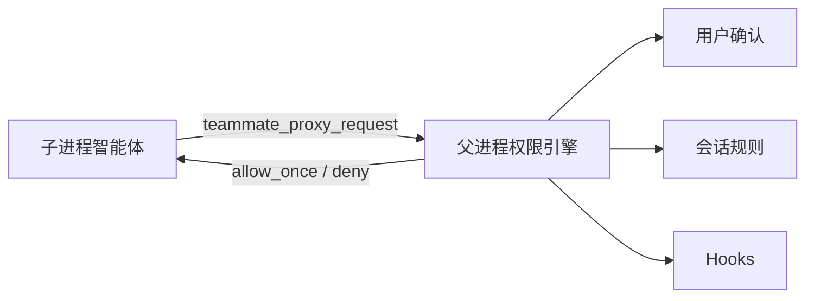

完整的工具调用权限控制：5 种权限模式 + 细粒度 allow/ask/deny 规则 + teammate 子进程权限中继。

---

## 权限模式

| 模式 | 行为 |
|------|------|
| `default` | 默认模式，危险操作需用户确认 |
| `acceptEdits` | 自动接受文件编辑，其他操作仍需确认 |
| `plan` | 计划模式，仅允许只读操作 |
| `dontAsk` | 不询问，自动允许所有操作 |
| `bypassPermissions` | YOLO 模式，跳过所有权限检查（可被配置禁用） |

> 默认启用 YOLO（`bypassPermissions`），可配置关闭。

## 权限规则

三种行为级别：

| 行为 | 说明 |
|------|------|
| `allow` | 自动允许，不询问 |
| `ask` | 每次询问用户 |
| `deny` | 拒绝执行 |

规则可配置在会话级（临时）或本地设置文件（持久）：

```json
{
  "permissions": {
    "defaultMode": "default",
    "allow": ["Bash(npm test)", "Bash(npm run *)"],
    "ask": ["Bash(rm *)"],
    "deny": ["Bash(rm -rf /)"],
    "disableBypassPermissionsMode": "disable"
  }
}
```

### 始终允许的工具

以下工具在任何模式下自动允许（只读或无副作用）：

`Read`, `Grep`, `Glob`, `Ls`, `Find`, `ffgrep`, `fffind`, `ask-user-question`, `teammate`, `teammate-send`, `teammate-list`, `teammate-watch`, `goal`, `todo`, `plan-*`, `search_tool_bm25`

## Teammate 子进程权限中继

Teammate 子进程没有本地终端，权限请求通过 IPC 中继到父进程处理：

- 父进程拥有实时模式、会话规则、钩子和持久化；
- 子进程的权限请求通过 `teammate_proxy_request` 转发；
- 父进程执行权限评估并返回 `allow_once` 或 `deny`。



## 与 Plan 模式的关系

`plan` 权限模式与[计划模式](/guides/goal-plan-todo)一致：仅允许只读操作，编辑/写入工具被阻止。`Alt+Shift+P` 或 `/plan` 切换。

## 下一步

- [Hooks 自动化与快捷键](/guides/hooks-keybindings) — 钩子与权限的协同
- [Goal 目标 · Plan 计划 · todo 任务](/guides/goal-plan-todo) — 计划模式详解
- [设置系统总览](/guides/settings-overview) — 权限配置的持久化位置
