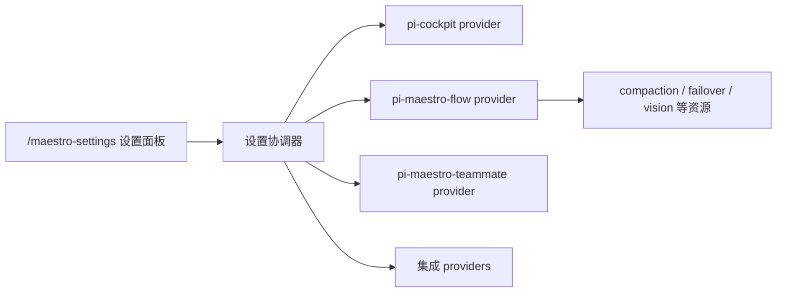

版本化 Settings 契约（`pi-maestro-settings-core`）协调各插件的配置：作用域（全局/项目）、持久化、冲突处理与统一设置界面。

---

## 架构



- **pi-maestro-settings-core**：版本化 Settings 与 i18n 契约，被所有 Maestro 插件共享；
- **Settings Providers**：每个插件暴露一个 provider，声明可配置项、校验与持久化策略；
- **统一设置面板**：`/maestro-settings` 打开设置 Shell（Cockpit、Flow、Teammate 与集成）。

## 作用域与配置文件

| 作用域 | 路径 | 说明 |
|--------|------|------|
| 用户级（global） | `~/.pi/agent/settings.json`（`PI_CODING_AGENT_DIR` 可覆盖） | 跨项目共享 |
| 项目级（project） | `<项目>/.pi/settings.json` | 随项目分发，覆盖用户级 |

### 配置示例

```json
{
  "compaction": {
    "enabled": true,
    "reserveTokens": 16384,
    "keepRecentTokens": 20000,
    "model": "provider/compaction-model",
    "soft": {
      "enabled": true,
      "nudgeRatio": 0.7,
      "pruneRatio": 0.8,
      "pruneTargetRatio": 0.7
    }
  },
  "permissions": {
    "defaultMode": "default",
    "allow": ["Bash(npm test)"]
  }
}
```

## 各插件的设置面

| Provider | 覆盖的配置 |
|----------|-----------|
| `pi-maestro-flow` | compaction、模型故障转移（failover）、vision 委托等资源 |
| `pi-maestro-teammate` | teammate 调度相关设置 |
| `pi-cockpit` | 界面配置（`~/.pi/agent/cockpit.json`） |
| 集成 providers | MCP（`mcp-settings-provider`）、Skills（`skills-settings-provider`）、Smart Search（`smart-search-settings-provider`）、API Manager（`api-manager-settings-provider`） |

## 持久化与并发

- **资源锁**：`resource-lock` 防止多会话并发写同一配置文件；
- **耐久写入**：`durable-write` 提供 fsync 级持久化，防掉电丢失；
- **版本化契约**：`SETTINGS_PROTOCOL_VERSION` 协商，旧版插件安全降级。

## In-Shell 设置套件（v0.16.0+）

配置全部在 Shell 内完成，不再跳转到系统原生选择器：API Manager、Hooks、主题、Provider 导航、故障转移链（列表 CRUD）与探索 Provider 均在设置界面内直接操作（旧式跳转动作已移除）。Provider 动作结果直接渲染在 Shell 内，配套权限总览；`teammate` 角色目录也已内嵌呈现。

## 设置入口速查

| 入口 | 用途 |
|------|------|
| `/maestro-settings` | 统一设置面板（全部插件） |
| `/cockpit` | Cockpit 设置覆盖层 |
| `/api-manager` | API Provider 管理（启用/停用、请求头编辑） |
| `/mcp` | MCP 服务器管理 |
| `/smart-search config` / Alt+S | Smart Search 配置 |
| Alt+M / `/teammate-models` | taskType → 模型映射 |

> 以上全部 TUI 的完整按键映射与操作流程见 [TUI 操作指南](/guides/tui-guide)。

## 下一步

- [API Provider 与模型故障转移](/guides/api-provider-config) — 模型与熔断配置
- [Compaction 容量管理](/guides/compaction-config) — 压缩阈值配置
- [Vision 多模态委托](/guides/vision-config) — 图片委托配置
